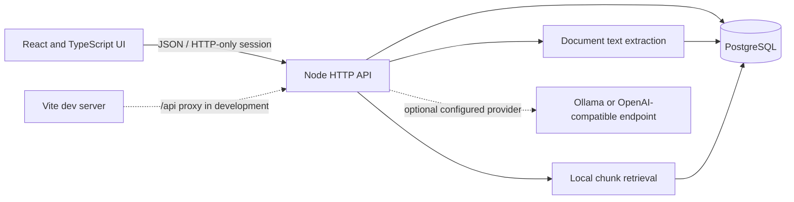

# Architecture

## Runtime shape

The React and TypeScript single-page application is built with Vite. During development, `scripts/dev.mjs` starts Vite and the Node API; Vite proxies `/api` calls to the API. In production, `server/index.js` serves the compiled `dist/` assets and SPA route fallback alongside the API.

The Node HTTP service in `server/app.js` handles input validation, sessions, role checks, platform logic, and JSON responses. `server/database.js` initializes PostgreSQL and runs the starter framework. PostgreSQL stores user accounts, competency progress, courses, assessment results, learning content, notifications, and audit records. Uploaded original files are parsed in memory; extracted text, metadata, and chunks are saved.

## Main request flow

1. Learners create an account in the app; an administrator account is provisioned using environment configuration.
2. The browser sends `/api/auth/login` and receives an HttpOnly session cookie.
3. Authenticated routes resolve the session and authorize by role.
4. Assessments record answers and evidence, update competency levels, recalculate gaps, and refresh recommendations.
5. Learning actions update progress. Completion is self-reported unless an external provider is connected.
6. Assistant requests retrieve relevant content chunks, produce a source-grounded answer, persist the conversation, and return source metadata.
7. Trainers add learning material or draft questions. Questions require trainer review before publication.

## Architectural boundaries

- UI and API communicate through the `/api` service boundary in `src/api.ts`.
- Database connection and schema setup are in `server/database.js`; `DATABASE_URL` configures PostgreSQL.
- AI calls are optional and provider-configured; deterministic grounded responses work without a provider.
- External course catalogues, identity providers, and learning completion systems are not connected by default.
