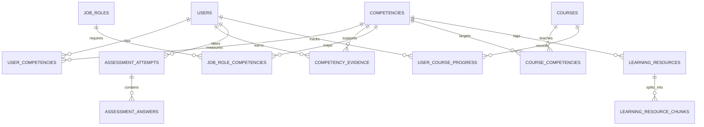

# PostgreSQL database

StatLearn uses PostgreSQL through the `pg` connection pool. Set `DATABASE_URL` in `.env`; do not put database credentials in source files. `server/database.js` creates the schema on startup and seeds the role and competency framework. PostgreSQL tables, indexes, and the seed process are defined there.

## Start a local database

Copy `.env.example` to `.env`, set a strong `POSTGRES_PASSWORD`, and make the password in `DATABASE_URL` match. The Compose setup starts PostgreSQL 17 and the application:

```powershell
docker compose up --build
```

For local Vite development, start only PostgreSQL and then the Node/Vite processes:

```powershell
docker compose up -d db
npm.cmd install
npm.cmd run dev
```

`DATABASE_URL` must use the host address (`127.0.0.1`) for Node running outside Compose. The app container uses the `db` service name. With a hosted PostgreSQL service, use its connection string and TLS requirements instead.

## Data and optional starter records

Schema creation, default roles, the organization and department defaults, and the competency framework run on every new database. Normal users sign up through the app. Set `BOOTSTRAP_ADMIN_EMAIL` and `BOOTSTRAP_ADMIN_PASSWORD` before first startup to create the first System Admin account; the password must be at least 12 characters.

Demo users, course examples, learning notes, and example assessment questions are not inserted by default. To load them for evaluation, set `SEED_DEMO_DATA=true` before startup. The demo users share the password `learn1234`; do not enable that seed option on a live database.

## Entity groups

| Group | Tables | Purpose |
| --- | --- | --- |
| Identity and access | `users`, `roles`, `permissions`, `role_permissions`, `user_roles`, `sessions` | Accounts, role assignments, permissions, and hashed sessions |
| Organisation and competency | `organizations`, `departments`, `job_roles`, `competency_categories`, `competencies`, `competency_levels`, `job_role_competencies`, `user_competencies`, `competency_evidence`, `skill_gaps` | Role expectations, learner evidence, levels, and gaps |
| Learning | `courses`, `course_competencies`, `course_prerequisites`, `user_course_progress`, `learning_paths`, `learning_path_items`, `recommendations` | Course catalogue, requirements, progress, and recommendations |
| Assessment and content | `assessment_questions`, `assessment_attempts`, `assessment_answers`, `learning_resources`, `learning_resource_chunks` | Questions, assessment records, source metadata, extracted passages, and optional JSON embeddings |
| Assistant and operations | `chat_sessions`, `chat_messages`, `notifications`, `audit_logs`, `integration_logs` | Conversation history, notices, audit events, and integration activity |

## Relationships



Back up PostgreSQL using your database provider's supported backup process. The existing SQLite development file is not migrated automatically; if it contains data you need, export and migrate it before pointing production users to PostgreSQL.
