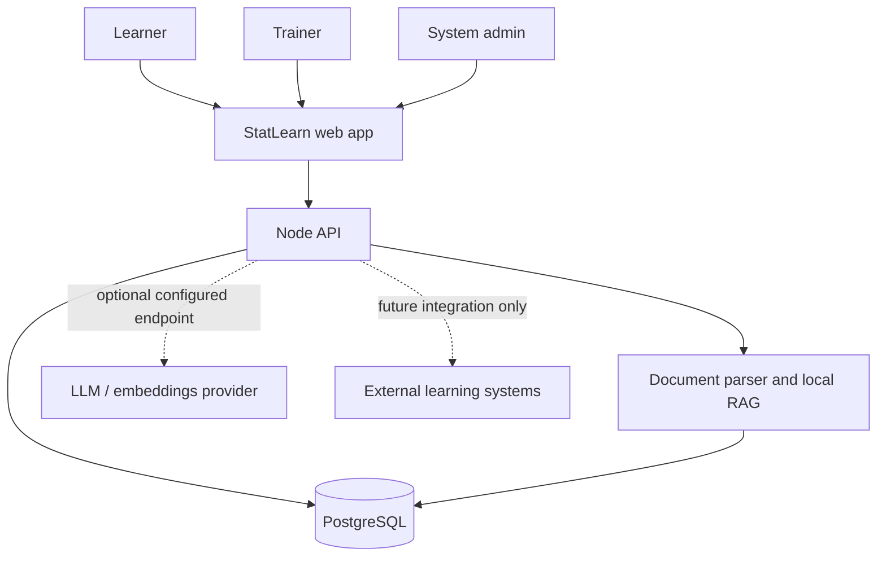
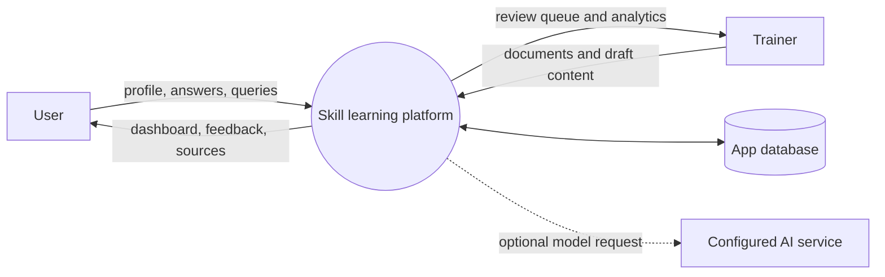
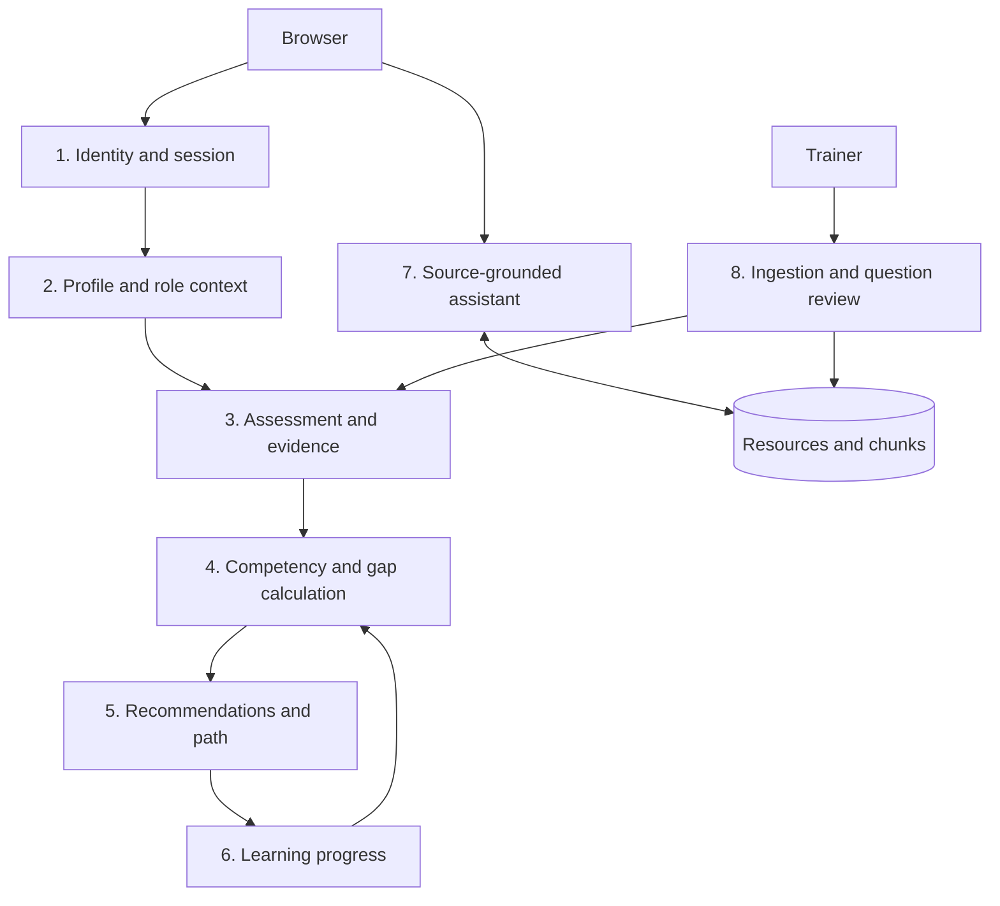
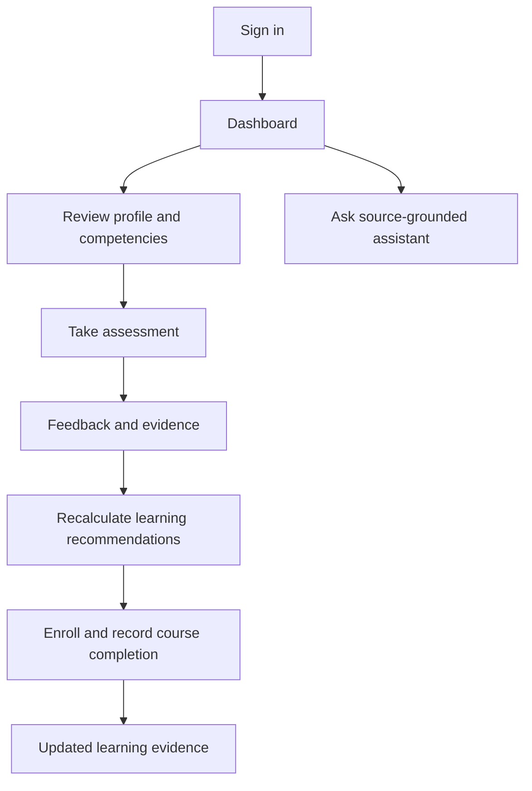
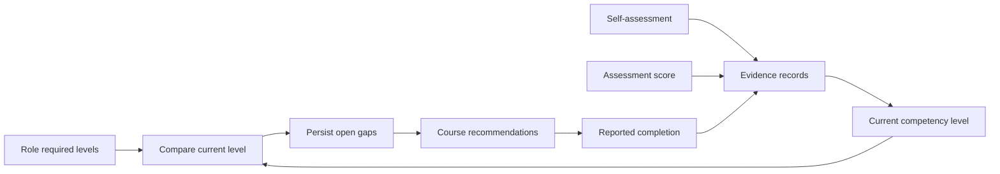
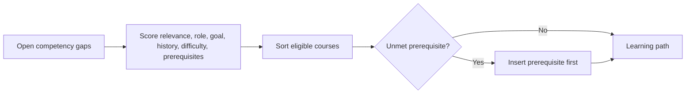
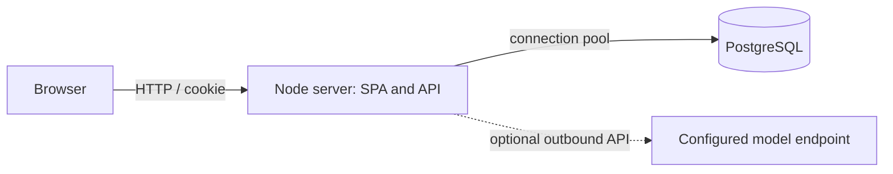

# System diagrams

## System context

## Data flow levels 0 and 1

## User flow

## Competency loop

## Recommendation sequence

## Deployment

The last diagram shows the local/container setup. It does not depict high availability or production government integrations.
