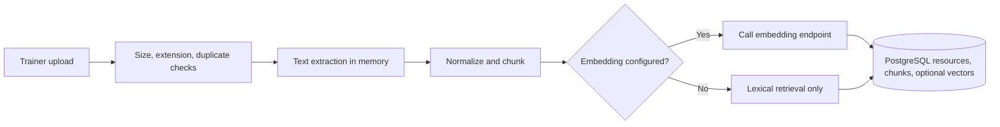
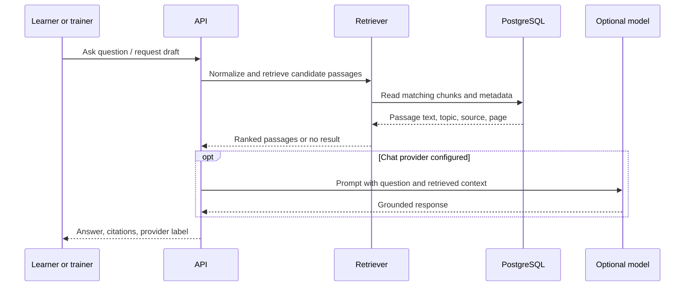

# Retrieval-augmented generation flow

## Ingestion

The trainer uploads PDF, DOCX, PPTX, TXT, or Markdown. The server checks file size and extension, parses in memory, normalizes extracted text, rejects empty/unreadable content, de-duplicates by SHA-256, and builds overlapping chunks. Resource metadata and chunks are stored in PostgreSQL. If an embedding endpoint is configured, chunk vectors are stored as JSON alongside the text. The original upload is not persisted.

## Question and answer

By default the vector path is absent and search is lexical. Optional vectors do not imply a vector database: they reside as JSON in PostgreSQL and are scanned in process. There is no OCR, reranker, hybrid index, source-authority registry, or citation entailment check. Scanned image-only PDFs fail with a clear message and must be OCR-processed before upload. `.ppt` is unsupported; convert to `.pptx`.
